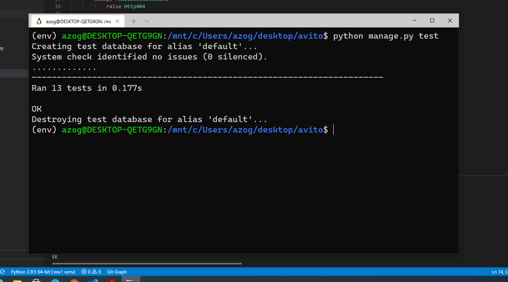
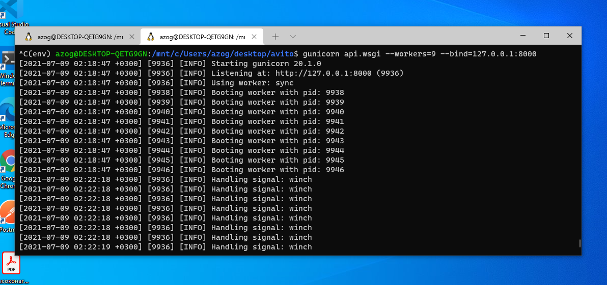
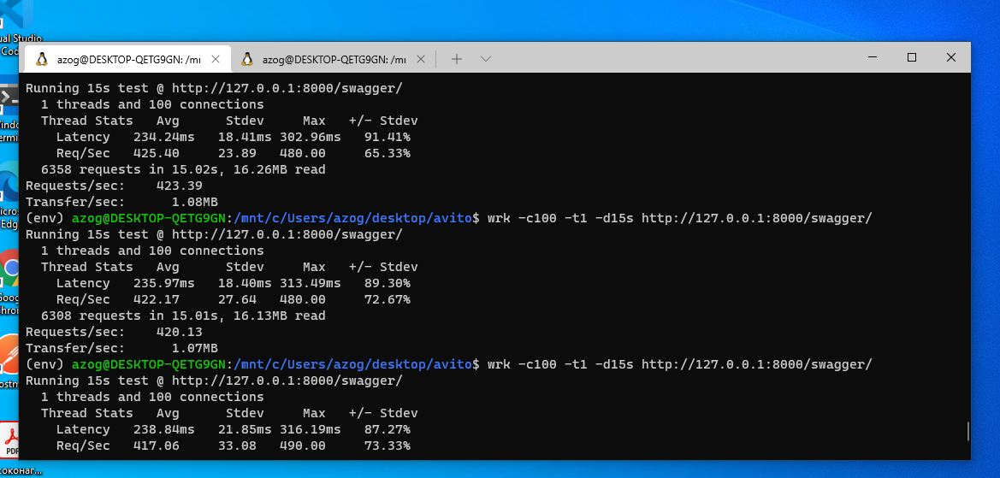

# JSON API сервис для голосования.

Программа реализованная с помощью Django REST Framework, 
в качестве результата генерирует JSON совместимые ответы.
[`Тестовое задание для стажера в юнит Market Intelligence`](https://github.com/avito-tech/mi-trainee-task-2021)

## Установка

На вашем компьютере должен быть установлен git и docker.

1. Для установки необходимо склонировать репозиторий:
```bash
git clone https://github.com/gazik05/django_polls_api
```
2. Вводим команду для создания docker образов:
```bash
docker-compose build
```
3. Как только образы будут собраны, запускаем контейнеры командой::
```bash
docker-compose up -d
```
4. Создаем миграции БД:
```bash
docker-compose exec web python manage.py makemigrations
```
5. Применяем миграции:
```bash
docker-compose exec web python manage.py migrate
```
6. Смотрим логи:
```bash
docker-compose logs -f
```
7. Для приостановки docker контейнеров используйте команду:
```bash
docker-compose down
```

### Методы
|Метод HTTP|URL|Действие|
|---|---|---|
|POST|/api/createPoll/|Создать голосование c вариантами ответов|
|POST|/api/poll/|Проголосовать за конкретный вариант: <poll_id, choice_id>|
|POST|/api/getResult/|Получить результат по конкретному голосованию: <poll_id>|


### Примеры запросов
Создать голосование c вариантами ответов
```
$ curl -X POST "http://127.0.0.1:8000/api/createPoll/" -H "accept: application/json; indent=4" -H  "Content-Type: application/json" -d '{"poll_text": "Как настроение?", "choices": [{"choice_text": "Отлично!"},  {"choice_text": "Плохо("}]}'
{
    "id": 1,
    "poll_text": "Как  настроение?",
    "choices": [
        {
            "id": 1,
            "choice_text": "Отлично!"
        },
        {
            "id": 2,
            "choice_text": "Плохо("
        }
    ]
}
```
Проголосовать за конкретный вариант: <poll_id, choice_id>|
```
$ curl -X POST "http://127.0.0.1:8000/api/poll/" -H "accept: application/json; indent=4" -H  "Content-Type: application/json" -d '{"poll_id": 1, "choice_id": 2}'
{
    "success": true
}
```
```
$ curl -X POST "http://127.0.0.1:8000/api/poll/" -H "accept: application/json; indent=4" -H  "Content-Type: application/json" -d '{"poll_id": 1, "choice_id": 1}'
{
    "success": true
}
```
```
$ curl -X POST "http://127.0.0.1:8000/api/poll/" -H "accept: application/json; indent=4" -H  "Content-Type: application/json" -d '{"poll_id": 1,  "choice_id": 2}'
{
    "success": true
}
```
Получить результат по конкретному голосованию: <poll_id>
```
$ curl -X POST "http://127.0.0.1:8000/api/getResult/" -H "accept: application/json; indent=4" -H  "Content-Type: application/json"  -d '{"poll_id": 1}'
{
    "result": [
        {
            "id": 1,
            "poll_id": 1,
            "choice_text": "Отлично!",
            "votes": 2
        },
        {
            "id": 2,
            "poll_id": 1,
            "choice_text": "Плохо(",
            "votes": 1
        }
    ]
}
```
### Документация доступна по адресу [http://127.0.0.1:8000/swagger/]

## [`Cхема архитектуры со всеми сущностями и их связями в Miro`](https://miro.com/app/board/o9J_l8N05Z0=/)

## Tests
Запустить тесты:
```bash
docker-compose exec web python manage.py test
```
<details><summary><b>Изображение</b></summary>  
</details>

## Нагрузочное тестирование
Запускаем django api с помощью WSGI HTTP сервера Gunicorn:
<details><summary><b>Изображение</b></summary>  
</details>

Проводим нагрузочное тестирование с помощью утилиты [`wrk`](https://github.com/wg/wrk):
<details><summary><b>Изображение</b></summary> 
</details>

#### Железо, на котором проводилось нагрузочное тестирование: 1) intel core i5 3470 (2012 год); 2) 8гб ram.
#### OS, на котором проводилось нагрузочное тестирование: Windows 10 (Windows Subsystem for Linux)

## Изменение архитектуры, если ожидается большая нагрузка:
    1) Масштабирование серверов(вертикальное масштабирование)
    2) Переход на другой более быстрый фреймворк(FastAPI), либо вообще на другой ЯП, например на GOLang.

## Защита от накруток:
    Нв стороне бекэнда можно создать отдельную сущность VOTE, которая бы привязывалась к определенному пользователю c помощью ForeignKey.